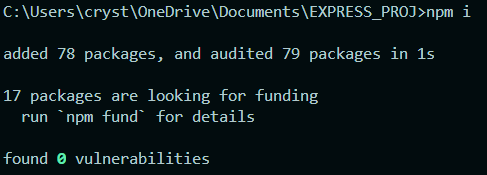
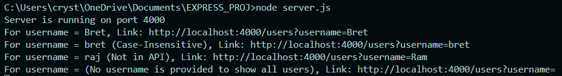
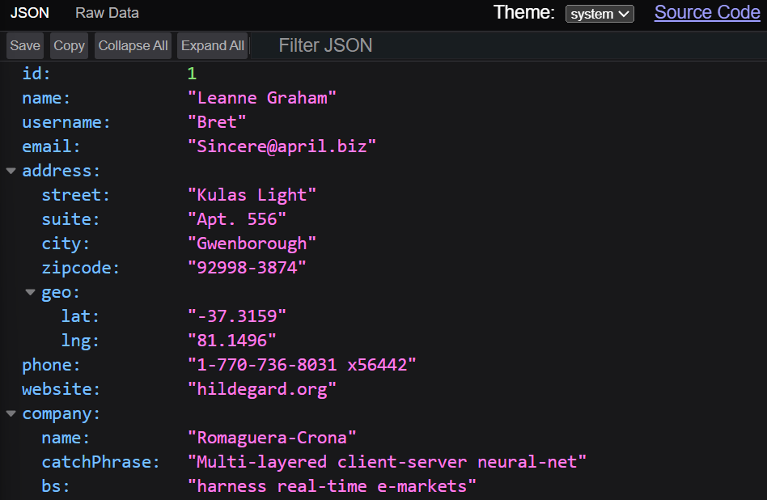
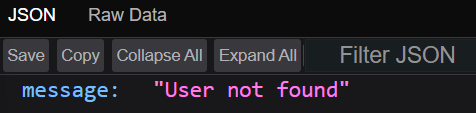
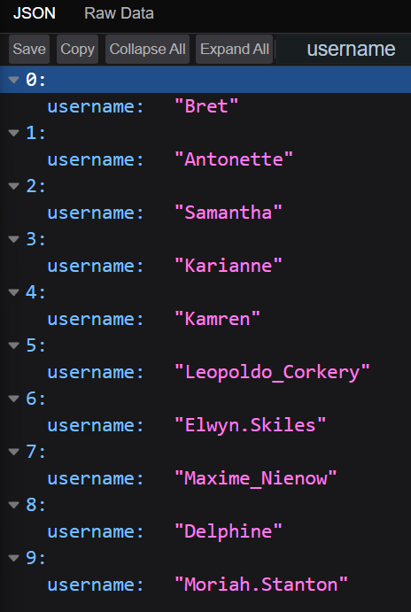

# Find User

## Step 1: Clone the repo
### Command: `git clone https://github.com/KeshavAbhishek/UserFind.git`
***

## Step 2: Installation
### Command: `npm i` to install the dependencies
### Output:

## Step 3: Run the server
### Command: `node server.js`
### Output:

## Outputs:
### For username = Bret, `http://localhost:4000/users?username=Bret`

### For username = bret (Case-Insensitive), `http://localhost:4000/users?username=bret`

### For username = Ram (Not in API), `http://localhost:4000/users?username=Ram`

### For username = (No username is provided to show all users), `http://localhost:4000/users?username=`
